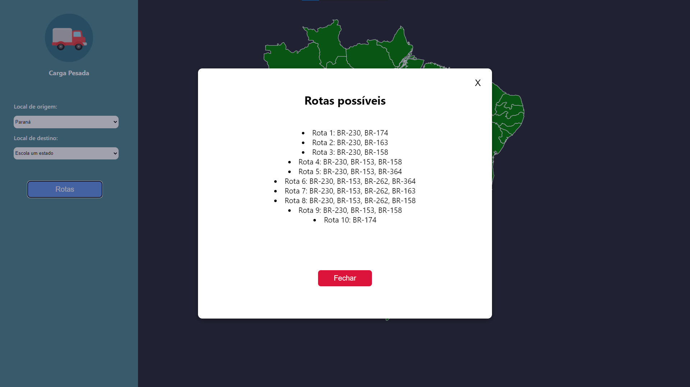

Temas:
 - Grafos1

# Grafos 1 - Carga Pesada


**Número da Lista**: 27<br>
**Conteúdo da Disciplina**: Grafos 1<br>

## Alunos
|Matrícula | Aluno |
| -- | -- |
| 16/0120918  |  Gabriel de Jesus Carvalho |
| 18/0054554  |  Paulo Batista |

## Sobre 
O carga pesada é um site para ajudar os famosos caminhoneiros, Pedro e Bino, a conseguirem se deslocar pelas maiores BRs do Brasil e fazerem suas entregas. 

## Screenshots




## Instalação 
**Linguagem**: JavaScript<br>
**Framework**: React<br>
Para rodar o projeto é necessário ter o NodeJs e o Yarn instalados.

Para instalar as dependências: 

```
  yarn install
```
Para executar o projeto: 

```
  yarn start
```

## Uso 
Basta selecionar o estados de origem, estado de destino e gerar a rota.


